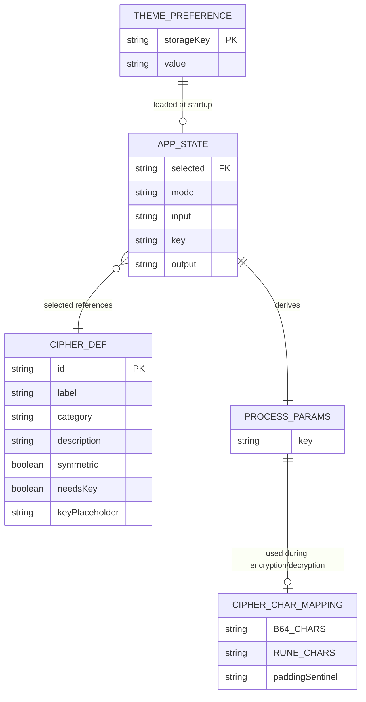

# Entity Relationship Document (ERD)

**Product:** Stèlegraphy
**Version:** 0.1.0
**Last Updated:** April 2026

---

## Overview

Stèlegraphy is a **stateless, client-side application** with no traditional relational database. There is no user account system, no server-side persistence, and no backend storage of any kind.

All state is ephemeral (held in React component state during a session) or persisted locally in the browser's `localStorage`.

This document describes the **logical data structures** used throughout the application.

---

## 1. Data Entities

### 1.1 CipherDef — Cipher Definition

Describes a cipher registered in the application's cipher registry (`src/lib/ciphers.ts`).

| Field | Type | Required | Description |
|---|---|---|---|
| `id` | `CipherId` | Yes | Unique identifier for the cipher (`'stelegraphy'`) |
| `label` | `string` | Yes | Human-readable display name |
| `category` | `Category` | Yes | Grouping label used in the sidebar |
| `description` | `string` | Yes | Short description shown in the UI |
| `symmetric` | `boolean` | No | If `true`, encrypt/decrypt use the same operation |
| `needsKey` | `boolean` | No | If `true`, a key input field is rendered |
| `keyPlaceholder` | `string` | No | Placeholder text shown in the key input field |

**Current registry:**

```ts
{
  id: 'stelegraphy',
  label: 'Stèlegraphy',
  category: 'Stèlegraphy',
  description: 'Custom symmetric block cipher that outputs an encrypted ciphertext in Ancient Runes.',
  needsKey: true,
  keyPlaceholder: 'Master Secret Key',
}
```

---

### 1.2 ProcessParams — Cipher Invocation Parameters

The parameter bag passed from `CryptoApp` through `process()` to the cipher function.

| Field | Type | Required | Description |
|---|---|---|---|
| `key` | `string` | Yes | The Master Key used for XOR masking; defaults to `"stele"` if empty |

---

### 1.3 AppState — Runtime Application State

The in-memory state held by `CryptoApp.tsx` during a browser session. Not persisted.

| Field | Type | Default | Description |
|---|---|---|---|
| `selected` | `CipherId` | `'stelegraphy'` | The currently active cipher |
| `mode` | `Mode` | `'encrypt'` | Current operation mode |
| `input` | `string` | `''` | User-entered text in the input panel |
| `key` | `string` | `''` | User-entered Master Key |
| `output` | `string` | `''` | Derived — computed from `(selected, mode, input, key)` |

---

### 1.4 ThemePreference — Persisted User Preference

Stored in browser `localStorage`. This is the only data persisted across sessions.

| Storage Key | Type | Allowed Values | Description |
|---|---|---|---|
| `stele-theme` | `string` | `'light'` or `'dark'` | User's selected theme preference |

If the key is absent, the theme defaults to `prefers-color-scheme`.

---

### 1.5 CipherCharMapping — Internal Cipher Alphabet

The static lookup tables used for the Runic Translation phase of the cipher.

| Name | Type | Length | Description |
|---|---|---|---|
| `B64_CHARS` | `string` | 64 | Standard Base64 alphabet: `A–Z a–z 0–9 + /` |
| `RUNE_CHARS` | `string` | 64 | 64 consecutive Elder Futhark rune codepoints: `ᚠ–ᛟ` |
| Padding sentinel | `string` | 1 | `=` (Base64) ↔ `᛫` (Runic middle dot) |

These are declared as module-level constants in `src/lib/crypto.ts` and never mutate.

---

## 2. Type Definitions

All types are defined in `src/types/index.ts`.

```ts
// The unique identifier of a registered cipher
type CipherId = 'stelegraphy';

// Available cipher categories for sidebar grouping
type Category = 'Stèlegraphy';

// The current operation direction
type Mode = 'encrypt' | 'decrypt';

// Full definition of a cipher registered in the app
interface CipherDef {
  readonly id:              CipherId;
  readonly label:           string;
  readonly category:        Category;
  readonly description:     string;
  readonly symmetric?:      boolean;
  readonly needsKey?:       boolean;
  readonly keyPlaceholder?: string;
}

// Parameters passed to the cipher processing function
interface ProcessParams {
  key: string;
}
```

---

## 3. Entity Relationship Diagram



---

## 4. Data Lifecycle

```
Application Load
      │
      ├─► localStorage['stele-theme']
      │         │
      │         └─► ThemePreference → ThemeContext (runtime)
      │
      └─► CIPHER_DEF registry (static, compile-time)
                │
                └─► Populates sidebar + AppState.selected default

User Interaction (Session)
      │
      ├─► AppState.input  (user types)
      ├─► AppState.key    (user types)
      ├─► AppState.mode   (user toggles)
      │         │
      │         ▼
      │   ProcessParams { key } ──► crypto.ts ──► CIPHER_CHAR_MAPPING
      │         │
      │         └─► AppState.output (derived, never stored)

User Closes Browser
      │
      └─► All AppState discarded (ephemeral)
          ThemePreference persists in localStorage
```

---

## 5. Data Constraints

| Rule | Description |
|---|---|
| Key fallback | An empty `key` defaults to `"stele"` inside the `Stelegraphy` class constructor |
| Input bounds | No enforced maximum length; cipher operates on the full input string |
| Valid Runic input | Decryption will `throw` if the input contains characters outside the Runic alphabet or if `atob()` fails (invalid Base64 after Rune→B64 reversion) |
| Theme values | Only `'light'` or `'dark'` are valid; any other `localStorage` value is ignored and the system preference is used |
| Cipher registry | `CipherId` is a union type — adding a new cipher requires updating `types/index.ts`, `ciphers.ts`, `crypto.ts`, and `process.ts` (enforced via exhaustive switch) |
